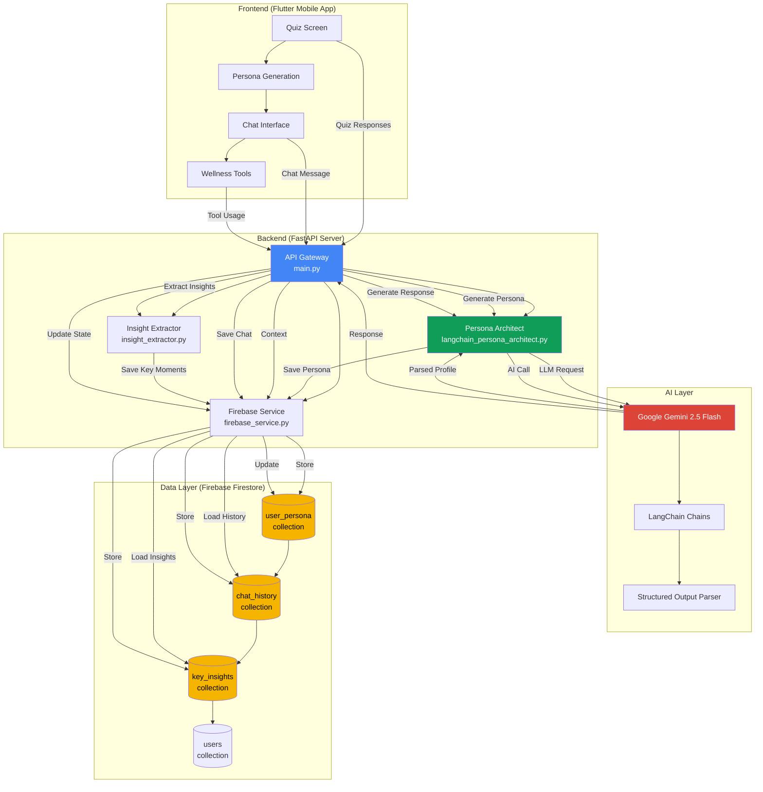
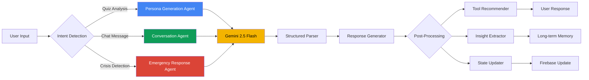
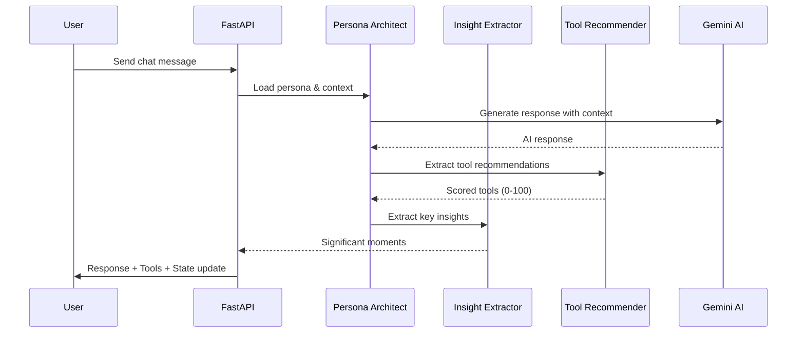
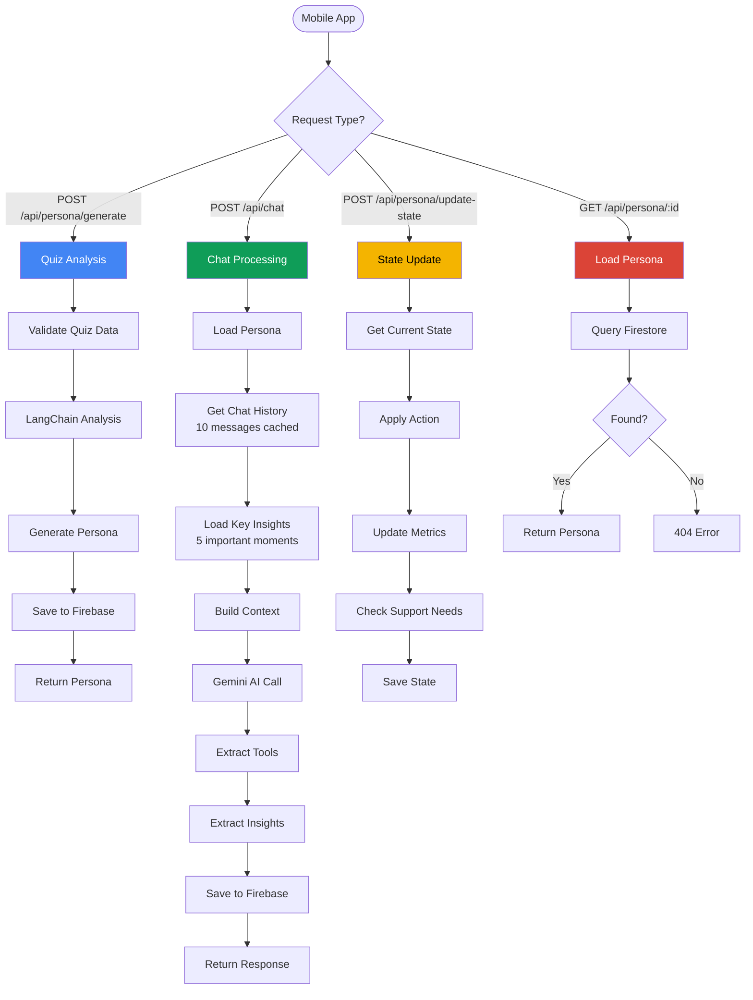
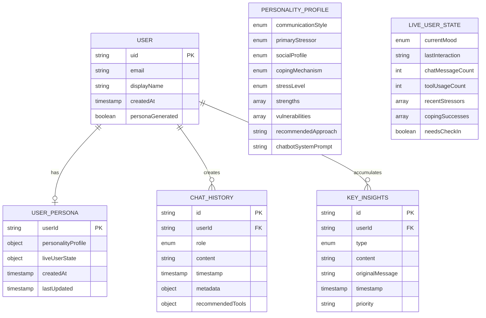
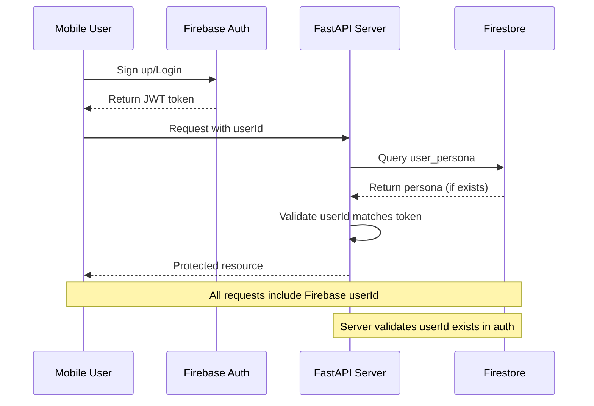
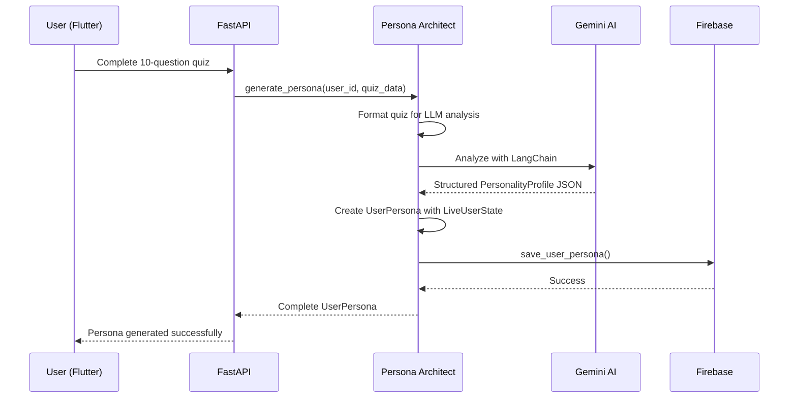
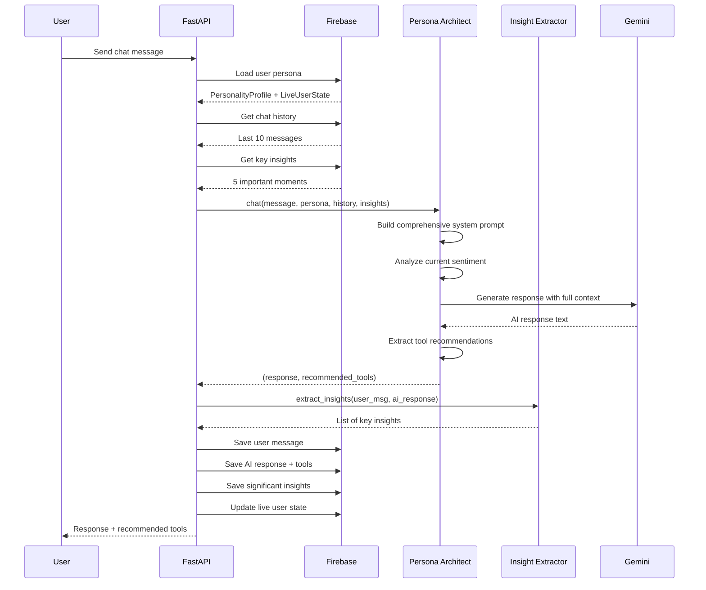
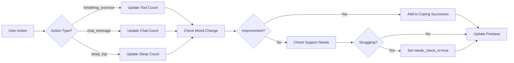

# 🍃 Serenique - AI Mental Wellness Companion

> **Built by [Avni Singhal](https://www.linkedin.com/in/avnisinghal001)** | **[GitHub](https://github.com/avnisinghal001)**

[](https://fastapi.tiangolo.com/)
[](https://ai.google.dev/)
[](https://www.langchain.com/)
[](https://firebase.google.com/)
[](https://www.python.org/)

**Serenique** is an AI-powered mental wellness chatbot designed specifically for college students dealing with stress, anxiety, sleep issues and academic pressure. Built with cutting-edge AI technology and psychological principles, Serenique provides personalized, empathetic support through an intelligent conversational interface.

---

## 📍 Table of Contents

- [Project Overview](#-project-overview)
- [System Architecture](#️-system-architecture)
- [OOP Design Principles](#-oop-design-principles)
- [AI & Prompt Engineering](#-ai--prompt-engineering)
- [API Architecture (Mermaid Diagrams)](#-api-architecture-mermaid-diagrams)
- [Tech Stack](#️-tech-stack)
- [Features](#-features)
- [Project Structure](#-project-structure)
- [Setup & Installation](#️-setup--installation)
- [API Endpoints](#-api-endpoints)
- [Core Components](#-core-components)
- [Workflow & Data Flow](#-workflow--data-flow)
- [Frontend Integration](#-frontend-integration)
- [Deployment](#-deployment)

---

## ⭐ Project Overview

### The Problem
College students face unprecedented mental health challenges:
- **75%** experience moderate to severe stress
- **60%** struggle with anxiety and academic pressure
- **45%** report poor sleep quality affecting their well-being
- Traditional mental health resources are often inaccessible, expensive or stigmatized

### The Solution
**Serenique** provides:
- **24/7 accessible** AI mental wellness support
- **Personalized** responses based on psychological profiling
- **Evidence-based** techniques (Breathing, mindfulness, grounding)
- **Long-term memory** that remembers past conversations
- **Proactive support** when users need check-ins
- **Privacy-first** approach with secure Firebase storage

### Tech Innovation
- **Google Gemini 2.5 Flash** for fast, empathetic AI responses
- **LangChain framework** for structured AI outputs and prompt engineering
- **FastAPI** for high-performance async REST API
- **Firebase Firestore** for real-time data synchronization
- **Flutter** frontend for beautiful cross-platform mobile experience

---

## ⭐ System Architecture



### Architecture Layers

1. **Presentation Layer** (Flutter)
   - Quiz-based onboarding
   - Real-time chat interface
   - Wellness tool integrations

2. **Application Layer** (FastAPI)
   - RESTful API endpoints
   - Request validation with Pydantic
   - CORS middleware for cross-origin requests
   - Async request handling

3. **Business Logic Layer**
   - Persona generation from quiz analysis
   - Context-aware chat response generation
   - Live state management
   - Insight extraction and memory management

4. **AI Layer** (Google Gemini + LangChain)
   - Prompt engineering and templating
   - Structured output parsing
   - Multi-turn conversation handling
   - Tool recommendation intelligence

5. **Data Layer** (Firebase Firestore)
   - User persona storage
   - Chat history 
   - Key insights for long-term memory
   - User authentication integration

---

## ⭐ OOP Design Principles

### Core Design Patterns Used

#### 1. **Singleton Pattern** (`FirebaseService`)
```python
class FirebaseService:
    _instance = None
    _initialized = False
    
    def __new__(cls):
        """Ensures only one Firebase Admin SDK instance exists"""
        if cls._instance is None:
            cls._instance = super(FirebaseService, cls).__new__(cls)
        return cls._instance
```

**Why?** Firebase Admin SDK should only be initialized once to prevent connection overhead and resource waste.

#### 2. **Facade Pattern** (`LangChainPersonaArchitect`)
Simplifies complex interactions with LangChain, Gemini API, and data models:
```python
class LangChainPersonaArchitect:
    def generate_persona(self, user_id, quiz_data) -> UserPersona:
        # Hides complexity of:
        # - LLM prompt engineering
        # - Output parsing
        # - Data validation
        # - Error handling
```

**Why?** Provides a clean, simple interface for persona generation while hiding the complexity of LangChain chains, prompt templates, and parsing logic.

#### 3. **Strategy Pattern** (Coping Mechanisms)
Different therapeutic approaches based on personality:
```python
class CopingMechanism(str, Enum):
    ANALYTICAL = "analytical"  # CBT-based approaches
    AFFECTIVE = "affective"    # Emotion-focused therapy
    MIXED = "mixed"            # Hybrid approach
```

**Why?** Allows runtime selection of therapeutic strategies based on user personality profile.

#### 4. **Builder Pattern** (System Prompt Construction)
Complex prompt building with multiple components:
```python
def chat(self, user_message, persona, chat_history, key_insights):
    # Builds comprehensive system prompt from:
    # - Personality profile
    # - Live user state
    # - Sentiment analysis
    # - Key insights
    # - Therapeutic guidelines
    system_prompt = self._build_system_prompt(...)
```

#### 5. **Observer Pattern** (State Updates)
Live user state updates trigger adaptive responses:
```python
def update_user_state(self, current_state, action):
    # Observes user actions and updates state
    if action_type == "breathing_exercise":
        # Update mood, track success, check for support needs
```

### SOLID Principles in Action

📌 **Single Responsibility Principle**
- `FirebaseService`: Only handles database operations
- `InsightExtractor`: Only extracts key insights from conversations
- `LangChainPersonaArchitect`: Only handles AI persona logic

📌 **Open/Closed Principle**
- New wellness tools can be added without modifying core state update logic
- New insight types can be added to `InsightExtractor` without changing existing code

📌 **Liskov Substitution Principle**
- All Enum types (`CommunicationStyle`, `Mood`, etc.) are interchangeable where their base type is expected

📌 **Interface Segregation Principle**
- Pydantic models define minimal required fields
- Optional parameters use `Optional` type hints

📌 **Dependency Inversion Principle**
- High-level modules (`main.py`) depend on abstractions (Pydantic models)
- Low-level modules implement these abstractions

---

## ⭐ AI & Prompt Engineering

### Agentic Workflow Architecture

Serenique implements an **intelligent agentic AI system** with multiple specialized capabilities:



### Core Prompt Engineering Techniques

#### 1. **System Persona Design**

The AI operates under a carefully crafted identity:

```python
core_identity = """
You are **Serebot**, a calm, wise, and solution-oriented mental well-being AI mentor 
created by **Avni Singhal**.

You embody peace, compassion, and grounded understanding.
You are a **safe harbor** — calm waters where users can rest and regain clarity.

Your purpose:
1. **Soothe first** – create emotional safety and validation
2. **Guide second** – offer thoughtful, actionable steps
3. **Empower third** – encourage progress and autonomy, never dependency
"""
```

**Key Principles:**
- **Emotional Pacing**: Soothe → Guide → Empower (3-phase response structure)
- **Authenticity**: "Safe harbor" metaphor creates trust

#### 2. **Dynamic Context Injection**

The prompt adapts based on real-time user state:

```python
# Sentiment-based adaptation
if mood == "anxious":
    context += """
    **CURRENT SENTIMENT: ANXIOUS/OVERWHELMED**
    - Use slow, steady language—avoid rushing
    - Acknowledge anxiety without amplifying it
    - Suggest: Box Breathing, 5-4-3-2-1 Grounding
    """
elif mood == "happy":
    context += """
    **CURRENT SENTIMENT: POSITIVE MOMENTUM**
    - Match their energy naturally
    - Reinforce what's working
    - Build on momentum without pressuring
    """
```

#### 3. **Long-Term Memory Integration**

Key insights from past conversations are injected:

```python
insights_context = """
📌 IMPORTANT PAST MOMENTS (Long-term Memory):
  • [STRESSOR] High stress about midterm exams
    Context: "I have 3 exams next week..." (Nov 10, 3:42 PM)
  • [BREAKTHROUGH] Realized exam anxiety triggers perfectionism
    Context: "I understand now why I get so anxious..." (Nov 11, 10:15 AM)
    
⚠️ REFERENCE THESE NATURALLY:
  - "I remember you mentioned that exam stress..."
  - "Yesterday you realized your perfectionism..."
"""
```

**Why This Works:**
- Creates continuity across sessions
- Makes AI feel like it "remembers" you
- Enables deeper, more meaningful conversations

#### 4. **Hallucination Prevention Protocol**

Strict guidelines prevent AI from fabricating information:

```python
safety_protocol = """
FACTUAL & HALLUCINATION SAFETY PROTOCOL:

1. Do not invent facts, statistics, events, or names
2. If unsure, respond with gentle transparency:
   > "I don't have verified information on that, but we can explore general ways..."
3. Ground suggestions in well-known practices (mindfulness, CBT, breathing)
4. Never simulate real people or organizations unless publicly verifiable
5. Always default to safety, calmness, and truthfulness over fluency
"""
```

#### 5. **Tool Recommendation Intelligence**

AI analyzes responses to suggest relevant wellness tools:

```python
analysis_prompt = f"""
Analyze this AI response and determine which wellness tools are most relevant.

Score each tool from 0-100 based on:
- Direct mentions (highest weight)
- Implicit relevance to symptoms
- Contextual fit for the situation

Tools:
- diaphragmatic_breathing: Deep belly breathing for general stress relief
- box_breathing: 4-4-4-4 technique for focus and mental clarity
- five_four_three_two_one: Sensory grounding during panic
...

Return JSON with scores:
{{
  "diaphragmatic_breathing": 0.0,
  "box_breathing": 85.0,  # Mentioned for focus
  "five_four_three_two_one": 70.0  # Highly relevant for anxiety
  ...
}}
"""
```

**Scoring Logic:**
- **90-100**: Explicitly mentioned in response
- **70-89**: Strongly implied/highly relevant
- **50-69**: Moderately relevant
- **30-49**: Somewhat relevant
- **0-29**: Low relevance

#### 6. **Crisis Detection & Emergency Response**

Immediate protective response for self-harm indicators:

```python
crisis_patterns = [
    'hurt myself', 'harm myself', 'kill myself', 'suicide',
    'want to die', 'better off dead', 'self harm', 'cutting'
]

crisis_response = """
I hear how painful this feels right now. You're not alone.
It's really important to reach out for help — if you're in India, 
you can contact **AASRA at 022 2754 6669**, or visit **findahelpline.com**.
You don't have to face this alone — help is available.
"""
```

### Prompt Structure Breakdown

#### Quiz Analysis Prompt
```python
quiz_prompt = """
You are an expert clinical psychologist specializing in personality assessment 
for college students.

Analyze these quiz responses and generate a comprehensive personality profile:

Q1: "When you're stressed, how do you prefer to work through it?"
Answer: Talk it out with someone

Q2: "When you see posts about others' achievements..."
Answer: Behind or inadequate

...

Generate PersonalityProfile with:
1. Core dimensions (communication_style, primary_stressor, social_profile)
2. Strengths and vulnerabilities
3. Recommended therapeutic approach
4. Complete chatbot_system_prompt (300-500 words)

The system prompt should include:
- Core identity and role
- Tone and communication style
- Therapeutic methodology
- Crisis handling guidance
"""
```

#### Chat Response Prompt
```python
chat_prompt = """
[CORE IDENTITY] → Serebot by Avni Singhal
[PERSONALITY CONTEXT] → {user's quiz-based profile}
[LIVE STATE] → Current mood: anxious, Recent stressors: exams
[CONVERSATION HISTORY] → Last 10 messages
[KEY INSIGHTS] → Important past moments
[WELLNESS TOOLS] → Available interventions
[SENTIMENT ANALYSIS] → Needs gentle support right now
[SAFETY PROTOCOLS] → Crisis detection, hallucination prevention

User: "I can't sleep, exam tomorrow, so worried"

Response:
→ [COMFORT] "That exam anxiety keeping you up... I hear you"
→ [GUIDE] "Let's try 4-7-8 Breathing to help you wind down"
→ [EMPOWER] "You've prepared—your mind just needs rest now"
"""
```

### Promptology Innovations

#### Multi-Agent Coordination


#### Adaptive Prompt Chaining

**Chain 1: Quiz Analysis**
```
Input: Raw quiz responses
↓
Prompt: Psychologist analyzing personality
↓
Output: Structured PersonalityProfile
```

**Chain 2: System Prompt Generation**
```
Input: PersonalityProfile
↓
Prompt: Create custom chatbot persona
↓
Output: 500-word system prompt
```

**Chain 3: Conversational Response**
```
Input: System prompt + context + user message
↓
Prompt: Empathetic response generation
↓
Output: Personalized reply
```

**Chain 4: Tool Recommendation**
```
Input: AI response text
↓
Prompt: Analyze wellness tool relevance
↓
Output: JSON with tool scores
```

---

## ⭐ API Architecture (Mermaid Diagrams)

### Request Flow Architecture



### Data Model Architecture



### Authentication & Security Flow



---

## ⭐ Tech Stack

### Backend
- **FastAPI** - High-performance async web framework
- **Python** - Core language
- **Uvicorn** - ASGI server for production
- **Pydantic** - Data validation and settings management

### AI/ML
- **Google Gemini 2.5 Flash** - Large language model for conversation
- **LangChain** - LLM application framework
- **LangChain Google GenAI** - Gemini integration
- **JsonOutputParser** - Structured output validation

### Database
- **Firebase Admin SDK** - Backend authentication and database
- **Cloud Firestore** - NoSQL document database
- **Firebase Authentication** - User management

### DevOps & Deployment
- **Vercel** - Serverless deployment platform
- **GitHub** - Version control

### Frontend (Separate Repository)
- **Flutter** - Cross-platform mobile framework
- **Dart** - Programming language
- **Firebase SDK** - Client-side integration

---

## ⭐ Features

### 1. **Intelligent Persona Generation**
- 10-question psychological quiz
- LangChain-powered analysis using Gemini
- Generates comprehensive personality profile:
  - Communication style (logical/emotional/balanced)
  - Primary stressors (academic/social/sleep/general)
  - Social profile (introvert/extrovert/ambivert)
  - Coping mechanisms (analytical/affective/mixed)
  - Stress level assessment

### 2. **Personalized Chat Experience**
- Context-aware responses based on personality
- Adapts to current mood and recent stressors
- References past conversations naturally
- Provides evidence-based coping strategies
- Suggests relevant wellness tools

### 3. **Long-Term Memory System**
- Automatically extracts key insights from conversations
- Stores important moments:
  - **Stressors**: New stress sources mentioned
  - **Breakthroughs**: Positive realizations
  - **Support Needs**: Explicit help requests
  - **Milestones**: Achievements and progress
  - **Crisis**: Urgent situations requiring attention
- AI references these memories in future conversations

### 4. **Intelligent Tool Recommendations**
- AI analyzes responses and suggests relevant tools
- 13 evidence-based wellness techniques:
  - **Breathing**: Diaphragmatic, Box, 4-7-8, Pursed-Lip
  - **Body Relaxation**: Body Mapping, Wave Breathing, Self-Hug
  - **Grounding**: 5-4-3-2-1, Texture Focus, Mental Grounding
  - **Meditation**: Body Scan, Mindful Walking, Mindful Eating
- Probability scores (0-100) for each tool
- Tracks which tools work for each user

### 5. **Live State Management**
- Real-time mood tracking
- Monitors wellness tool usage
- Detects when users need check-ins
- Tracks coping successes
- Updates activity metrics

### 6. **Performance Optimizations**
- **Reduced context window** (10 messages vs 50)
- **Async request handling**
- **Connection pooling** for Firebase

### 7. **Crisis Detection & Safety**
- Automatic detection of self-harm indicators
- Immediate compassionate response
- Provides emergency helpline resources
- Flags for human review

### 8. **Privacy & Security**
- End-to-end encryption with Firebase
- User data isolation
- No data sharing with third parties
- GDPR-compliant storage
- Secure API key management

---

## ⭐ Project Structure

```
serenique_cloud_server/
│
├── main.py                          # FastAPI application & endpoints
│   ├── /api/persona/generate        # Generate persona from quiz
│   ├── /api/persona/:id             # Get existing persona
│   ├── /api/persona/update-state    # Update live user state
│   ├── /api/chat                    # Main chat endpoint
│   ├── /api/chat/history/:id        # Get chat history
│   ├── /api/insights/:id            # Get key insights
│   └── /api/health                  # Health check
│
├── langchain_persona_architect.py   # Core AI logic
│   ├── LangChainPersonaArchitect    # Main class
│   ├── PersonalityProfile           # Pydantic model
│   ├── LiveUserState                # Dynamic state model
│   ├── UserPersona                  # Complete persona model
│   ├── generate_persona()           # Quiz → Persona
│   ├── chat()                       # Generate AI responses
│   ├── update_user_state()          # State management
│   └── _extract_tool_recommendations() # Tool scoring
│
├── firebase_service.py              # Firebase operations
│   ├── FirebaseService              # Singleton class
│   ├── save_user_persona()          # Store persona
│   ├── get_user_persona()           # Load persona
│   ├── save_chat_message()          # Store chat
│   ├── get_chat_history_optimized() # Load history (cached)
│   ├── save_key_insight()           # Store insights
│   └── get_relevant_insights()      # Load insights
│
├── insight_extractor.py             # Memory extraction
│   ├── InsightExtractor             # Main class
│   ├── extract_insights()           # Analyze conversations
│   ├── _detect_crisis()             # Safety detection
│   ├── _detect_stressors()          # Stress tracking
│   ├── _detect_breakthrough()       # Positive moments
│   └── should_save_insight()        # Filter significant insights
│
├── persona_architect.py             # Legacy persona logic
│   └── (Deprecated, replaced by LangChain version)
│
├── api/
│   └── index.py                     # Vercel serverless entry
│
├── requirements.txt                 # Python dependencies
├── vercel.json                      # Vercel configuration
├── .env                             # Environment variables (local)
├── .gitignore                       # Git ignore rules
└── README.md                        # This file
```

---

## ⭐ Setup & Installation

### Prerequisites
- Python 3.9 or higher
- Google Cloud API key (Gemini access)
- Firebase project with Firestore enabled
- Firebase Admin SDK credentials

### 1. Clone Repository
```bash
git clone https://github.com/avnisinghal001/serenique_cloud_server.git
cd serenique_cloud_server
```

### 2. Create Virtual Environment
```bash
python -m venv venv

# Activate virtual environment
# On Linux/Mac:
source venv/bin/activate

# On Windows:
venv\Scripts\activate
```

### 3. Install Dependencies
```bash
pip install -r requirements.txt
```

### 4. Configure Environment Variables

Create `.env` file in root directory:
```env
# Google Gemini API Key
GOOGLE_API_KEY=your_gemini_api_key_here

# Model Configuration
MODEL_NAME=gemini-2.5-flash
MODEL_TEMPERATURE=0.7

# Firebase Configuration (Option 1: JSON string)
FIREBASE_CREDENTIALS='{"type":"service_account","project_id":"..."}'

# Firebase Configuration (Option 2: File path)
GOOGLE_APPLICATION_CREDENTIALS=/path/to/firebase-adminsdk.json
```

### 5. Firebase Setup

#### Option A: Environment Variable
1. Go to Firebase Console → Project Settings → Service Accounts
2. Generate new private key (downloads JSON file)
3. Copy entire JSON content
4. Set `FIREBASE_CREDENTIALS` in `.env` with the JSON string

#### Option B: Local File
1. Download Firebase Admin SDK JSON file
2. Place in project root
3. Set `GOOGLE_APPLICATION_CREDENTIALS` path in `.env`

### 6. Run Development Server
```bash
uvicorn main:app --reload --host 0.0.0.0 --port 8000
```

Server runs at: `http://localhost:8000`

Interactive API docs: `http://localhost:8000/docs`

### 7. Test API

```bash
# Health check
curl http://localhost:8000/api/health

# Generate persona
curl -X POST http://localhost:8000/api/persona/generate \
  -H "Content-Type: application/json" \
  -d '{
    "user_id": "test_user_123",
    "quiz_data": {
      "1": "b", "2": "b", "3": "a", "4": "b", "5": "d",
      "6": "a", "7": "a", "8": "b", "9": "a", "10": "b"
    }
  }'
```

---

## ⭐ API Endpoints

### Persona Management

#### `POST /api/persona/generate`
Generate personalized chatbot persona from quiz responses.

**Request:**
```json
{
  "user_id": "firebase_auth_uid",
  "quiz_data": {
    "1": "b",
    "2": "a",
    "3": "c",
    ...
  }
}
```

**Response:**
```json
{
  "success": true,
  "user_persona": {
    "user_id": "firebase_auth_uid",
    "personality_profile": {
      "communication_style": "logical",
      "primary_stressor": "academics",
      "social_profile": "introverted",
      "coping_mechanism": "analytical",
      "stress_level": "moderate",
      "strengths": ["Self-aware", "Analytical thinking"],
      "vulnerabilities": ["Perfectionism", "Overthinking"],
      "recommended_approach": "CBT-based cognitive restructuring",
      "chatbot_system_prompt": "..."
    },
    "live_user_state": {
      "current_mood": "neutral",
      "last_interaction": "onboarding",
      ...
    }
  },
  "message": "Persona generated successfully"
}
```

#### `GET /api/persona/{user_id}`
Retrieve existing persona for a user.

**Response:**
```json
{
  "success": true,
  "user_persona": { ... },
  "message": "Persona retrieved successfully"
}
```

#### `POST /api/persona/update-state`
Update live user state based on app interactions.

**Request:**
```json
{
  "user_id": "firebase_auth_uid",
  "action": {
    "type": "breathing_exercise",
    "content": {
      "technique": "Box Breathing",
      "afterMood": "calm",
      "moodImprovement": "Improved"
    }
  }
}
```

### Chat

#### `POST /api/chat`
Send chat message and receive AI response.

**Request:**
```json
{
  "user_id": "firebase_auth_uid",
  "message": "I'm feeling really anxious about my exam tomorrow",
  "include_history": true
}
```

**Response:**
```json
{
  "success": true,
  "response": "I hear that exam anxiety... it's completely understandable...",
  "message": "Chat response generated successfully",
  "chat_history_saved": true,
  "recommended_tools": {
    "diaphragmatic_breathing": 15.0,
    "box_breathing": 85.0,
    "four_seven_eight_breathing": 75.0,
    "five_four_three_two_one": 70.0,
    ...
  }
}
```

#### `GET /api/chat/history/{user_id}?limit=50`
Get chat history for a user.

**Response:**
```json
{
  "success": true,
  "user_id": "firebase_auth_uid",
  "message_count": 25,
  "messages": [
    {
      "role": "user",
      "content": "I'm stressed about exams",
      "timestamp": "2025-11-12T10:30:00Z",
      "metadata": { "mood": "anxious" }
    },
    {
      "role": "assistant",
      "content": "I hear you...",
      "timestamp": "2025-11-12T10:30:05Z",
      "recommended_tools": { ... }
    }
  ],
  "message": "Successfully retrieved 25 messages"
}
```

### Insights

#### `GET /api/insights/{user_id}?limit=10`
Get key insights (long-term memory) for a user.

**Response:**
```json
{
  "success": true,
  "user_id": "firebase_auth_uid",
  "insights": [
    {
      "id": "insight_123",
      "type": "stressor",
      "content": "Academic stress detected: exam tomorrow",
      "original_message": "I have an exam tomorrow and...",
      "timestamp": "2025-11-12T10:30:00Z"
    },
    {
      "type": "breakthrough",
      "content": "Positive realization: I understand my anxiety triggers",
      ...
    }
  ],
  "stats": {
    "total_insights": 15,
    "by_type": {
      "stressor": 5,
      "breakthrough": 3,
      "milestone": 2
    }
  },
  "count": 10
}
```

### Utility

#### `GET /api/health`
Health check endpoint.

**Response:**
```json
{
  "status": "healthy",
  "service": "Serenique Gemini Persona Service",
  "version": "4.0.0",
  "gemini_configured": true,
  "firebase_initialized": true
}
```

#### `GET /api/stats`
Get persona generation statistics.

#### `GET /api/cache/stats`
Get cache performance metrics.

---

## ⭐ Core Components

### 1. LangChainPersonaArchitect

**Purpose**: Manages all AI-related operations using LangChain and Gemini.

**Key Methods**:
- `generate_persona()`: Analyzes quiz data and generates personality profile
- `chat()`: Generates context-aware AI responses
- `update_user_state()`: Updates dynamic user state based on interactions
- `_extract_tool_recommendations()`: Intelligently scores wellness tools

**Responsibilities**:
- Prompt engineering and template management
- LLM chain construction and invocation
- Structured output parsing with Pydantic
- Context building from multiple sources
- Sentiment analysis and adaptive communication

### 2. FirebaseService

**Purpose**: Handles all database operations with Firebase Firestore.

**Key Methods**:
- `save_user_persona()`: Store complete persona
- `get_user_persona()`: Load persona with caching
- `save_chat_message()`: Store chat with metadata
- `get_chat_history_optimized()`: Load history
- `save_key_insight()`: Store important moments
- `get_relevant_insights()`: Load long-term memories

**Responsibilities**:
- Singleton pattern for single Firebase connection
- In-memory caching for performance
- Error handling and retry logic
- Data serialization/deserialization
- Collection management

### 3. InsightExtractor

**Purpose**: Extracts significant insights from conversations for long-term memory.

**Key Methods**:
- `extract_insights()`: Analyze conversation and extract key moments
- `_detect_crisis()`: Identify self-harm or crisis situations
- `_detect_stressors()`: Find new stress sources
- `_detect_breakthrough()`: Recognize positive realizations
- `should_save_insight()`: Filter significant insights

**Responsibilities**:
- Pattern matching for different insight types
- Context extraction around keywords
- Priority assignment (crisis = urgent)
- Filtering noise from significant moments

---

## ⭐ Workflow & Data Flow

### User Onboarding Flow



### Chat Conversation Flow



### State Update Flow



---

## ⭐ Frontend Integration (Upcoming/TBA)

### Flutter App Structure

The Flutter mobile app integrates with this backend through:

1. **Firebase Authentication**
   - User registration and login
   - JWT token management
   - User ID for API requests

2. **Quiz Screen**
   - 10-question personality assessment
   - Sends responses to `/api/persona/generate`
   - Stores persona locally

3. **Chat Interface**
   - Real-time message UI
   - Sends messages to `/api/chat`
   - Displays AI responses
   - Shows recommended tools as cards

4. **Wellness Tools**
   - Breathing exercises (4 types)
   - Body relaxation (3 tools)
   - Grounding techniques (3 methods)
   - Mindfulness meditation (3 practices)
   - Sends usage data to `/api/persona/update-state`

---

## ⭐ Deployment

### Vercel Deployment

This project is optimized for serverless deployment on Vercel.

#### 1. Vercel Configuration

`vercel.json`:
```json
{
  "version": 2,
  "builds": [
    {
      "src": "api/index.py",
      "use": "@vercel/python"
    }
  ],
  "routes": [
    {
      "src": "/(.*)",
      "dest": "api/index.py"
    }
  ],
  "env": {
    "GOOGLE_API_KEY": "@google_api_key",
    "FIREBASE_CREDENTIALS": "@firebase_credentials",
    "MODEL_NAME": "gemini-2.5-flash",
    "MODEL_TEMPERATURE": "0.7"
  }
}
```

#### 2. Deploy to Vercel

```bash
# Install Vercel CLI
npm install -g vercel

# Login to Vercel
vercel login

# Deploy
vercel --prod
```

#### 3. Set Environment Variables

```bash
vercel env add GOOGLE_API_KEY
vercel env add FIREBASE_CREDENTIALS
vercel env add MODEL_NAME
vercel env add MODEL_TEMPERATURE
```

Or via Vercel Dashboard:
1. Go to Project Settings → Environment Variables

#### 4. Verify Deployment

```bash
curl https://your-project.vercel.app/api/health
```

---

## 🤝 Contributing

Contributions are welcome! Please follow these steps:

1. Fork the repository
2. Create a feature branch (`git checkout -b feature/AmazingFeature`)
3. Commit changes (`git commit -m 'Add AmazingFeature'`)
4. Push to branch (`git push origin feature/AmazingFeature`)
5. Open a Pull Request

---

## 📄 License

This project is proprietary software created by **Avni Singhal**.

---

## ⭐ Author

**Avni Singhal**

- LinkedIn: [linkedin.com/in/avnisinghal001](https://www.linkedin.com/in/avnisinghal001)
- GitHub: [github.com/avnisinghal001](https://github.com/avnisinghal001)
- Email: [singhalavni26@gmail.com](mailto:singhalavni26@gmail.com)

---

## ⭐ Acknowledgments

- **Google Gemini** for providing powerful LLM capabilities
- **LangChain** for excellent prompt engineering framework
- **Firebase** for scalable backend infrastructure
- **FastAPI** for elegant Python web framework
- **Vercel** for generous deployment infrastructure
- Mental health research community for evidence-based practices

---

**Built with ❤️ by Avni Singhal and Amon Sharma**